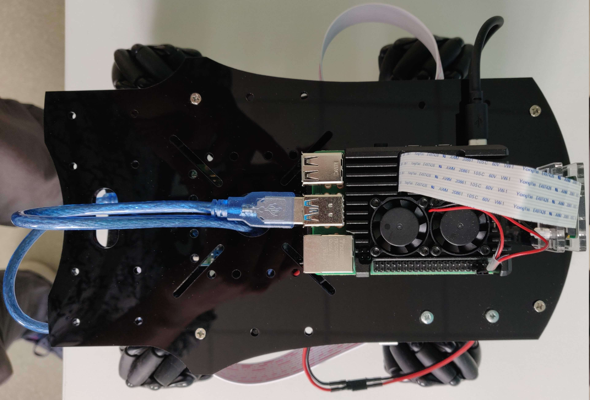
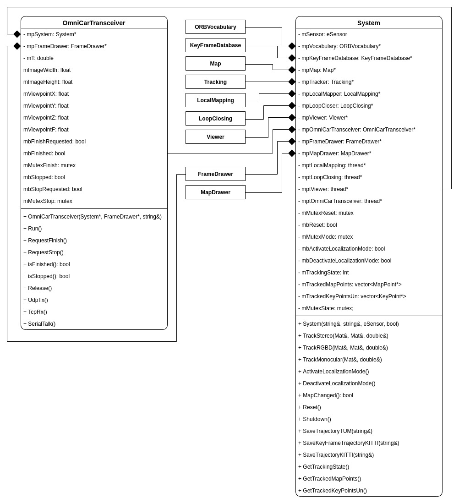

# Introduction
This repository is part of [OmniCar project](https://divelix.github.io/OmniCar/) and represents core part of the platform that runs ORB-SLAM2 and share data between microcontroller and remote GUI.

The program was tested on **Ubuntu 20.10**

# Showcase
Raspberry Pi 4 Model B runs code of this repository and placed on the 2nd floor of the mobile platform.


# Structure
This project can be described as ORB-SLAM2 + communication module. This communication module presented in a form of `OmniCarTransceiver` class. It communicates with Arduino MEGA via UART in half-duplex mode and remote GUI via UPD and TCP protocols.


# Prerequisites
This project was created as modification of ORB-SLAM2, so you need to install the following libraries first:
* [Pangolin](https://github.com/stevenlovegrove/Pangolin) - visualization and user interface. In OmniCar project it is not needed as it has own remote GUI for visualization, but I decided to save full ORB-SLAM2 project functionality so you can just toggle vanila ORB-SLAM2/platform functionality by boolean in `System` class constructor (false == platform mode).
* [Eigen3](https://eigen.tuxfamily.org/index.php?title=Main_Page) - linear algebra library required by g2o (**note:** you need to `sudo make install` it).
* [OpenCV](https://opencv.org/) - computer vision library to manipulate images and features. Latest version would be fine (**note:** [this](https://linuxize.com/post/how-to-install-opencv-on-ubuntu-20-04/) guide would be helpful).

# Building
Just as ORB-SLAM2, the project has `build.sh` file that will do the following:
* build `DBoW2`, 
* build `g2o`,
* uncompress ORB vocabulary,
* build `ORB-SLAM2`,
* convert ORB vocabulary from text to binary format (speeds up program launch).

Execute:
```
cd OmniCar-gui
chmod +x build.sh
./build.sh
```